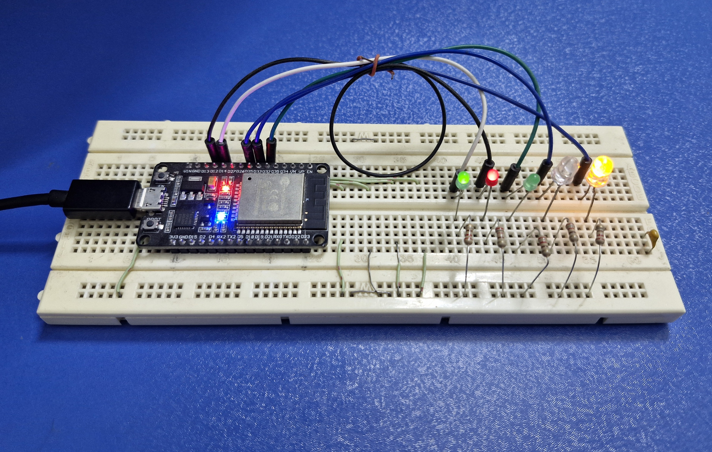

# Simple Smart Greenhouse

This project simulates a smart greenhouse system using DOIT ESP32 DEVKIT V1 Board with multitasking features.

## Features

- **Multitasking**: The system uses a non-blocking approach to handle multiple tasks simultaneously, including:
  1. **Checking light intensity**: Controls the light generator based on simulated time intervals
  2. **Monitoring input sensors**: Randomly generated values for temperature, humidity, and CO2 levels are printed to the serial monitor
  3. **Checking irrigation**: Simulates the irrigation system, turning on/off based on preset conditions

- **Randomized Input Simulation**: Inputs like temperature, humidity, and CO2 levels are simulated using random number generation and displayed in the serial monitor for easy tracking of changes
  
- **LED Outputs**: The system uses LEDs to represent key actions like irrigation, fan control, sprinklers, CO2 valve, and lighting. Short delay times are used for faster simulation purposes

## GPIO Pin Assignments

- **GPIO 2 (Onboard LED)**: Power/System Indicator
- **GPIO 14 (Fan)**: Green LED to simulate fan control for temperature regulation
- **GPIO 12 (Sprinkler)**: Red LED to simulate the sprinkler system for humidity control
- **GPIO 32 (CO2 Valve)**: Green LED to simulate the CO2 valve operation for CO2 regulation
- **GPIO 33 (Irrigation)**: Red LED to simulate the irrigation system
- **GPIO 25 (Light Generator)**: Yellow LED to simulate the light generator system

## System Functionality

1. **Light Generator Control**: The system turns the light generator (yellow LED) on and off in intervals to simulate day-night cycles
2. **Temperature Control**: Randomly generated temperatures (range -10°C to 50°C) determine whether the fan (green LED) should turn on (above 24°C) or off (below 18°C)
3. **Humidity Control**: Random humidity values (0% to 100%) trigger the sprinkler system (red LED) when humidity drops below 70%, and it turns off when humidity exceeds 90%
4. **CO2 Control**: Random CO2 levels (400 to 2000 ppm) control the CO2 valve (green LED), which opens below 1000 ppm and closes above 1300 ppm
5. **Irrigation System**: The irrigation system (red LED) operates in timed intervals
6. **Random Input Simulation**: Temperature, humidity, and CO2 levels are simulated using random number generation to provide dynamic sensor input

## Breadboard Setup

